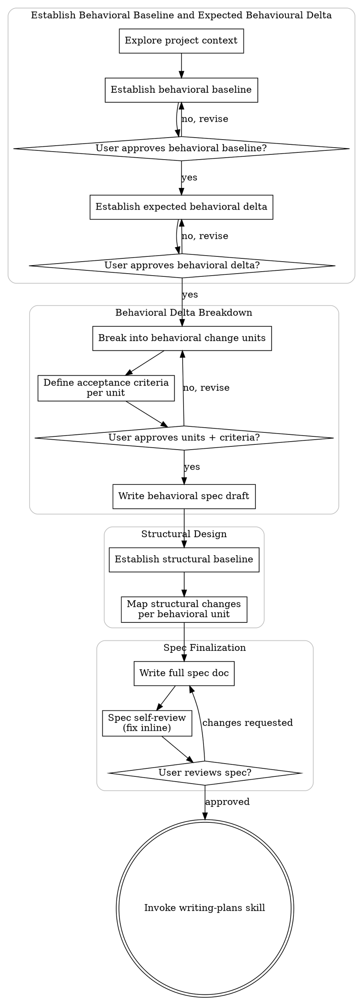

# Transforming user demands into specs

All changes in the code, even the smallest, happen downward from a spec and a plan.
All user demands, from product behaviour evolution to refactoring, MUST go through the following process.

<HARD-GATE>
Do NOT invoke any implementation skill, write any code, scaffold any project, or take any implementation action until you have presented a spec and the user has approved it. This applies to EVERY project regardless of perceived simplicity.
</HARD-GATE>

## Anti-Pattern: "This Is Too Simple To Need A Design"

Every project goes through this process. A todo list, a single-function utility, a config change — all of them. "Simple" projects are where unexamined assumptions cause the most wasted work. The spec can be short, but you MUST present it and get approval.

## How to think about changes

The developer makes changes to a system to change the system's behaviour. 

When delegating the changes to a coding agent, we MUST ALWAYS: 
1. Establish what the current system behaviour is. We call it the Behavioural Baseline
2. Establish what changes to this baseline we aim at making. We call that the Behavioural Delta.
3. Establish how the agent can automatically verify that the expected change in behaviour was achieved. We call those conditions the Acceptance Criteria.

Only once those are validated can we move on to looking at what changes will be made to the system internals (the code).

## Process Flow

**The terminal state is invoking writing-plans.** Do NOT invoke frontend-design, mcp-builder, or any other implementation skill. The ONLY skill you invoke after making-changes is writing-plans.

## Checklist

Use one checklist, but start from the appropriate point:

- **New evolution:** the user is asking for a behavior change that has not already gone through this spec process and has not already been implemented. Start from step 1.
- **Iteration:** a previous spec/plan/implementation already exists, and the user is asking for an additional behavior change or correction on top of it. Start from step 3, using the existing spec and implemented behavior as the inherited baseline.
- **Refactoring:** the user is asking for internal structural change with no intended external behavior change. Use the dedicated refactoring skill instead of this checklist.

Ask clarifying questions whenever they are needed to complete or validate a step,
but do not treat them as a separate checklist item.

You MUST create a task for each applicable item and complete them in order:

1. **Explore project context** — check files, docs, recent commits
2. **Establish behavioral baseline** — describe how the system behaves today
3. **Establish expected behavioral delta** — describe what behavior should change
4. **Present behavioral baseline and delta** — get user approval before decomposing behavior
5. **Break delta into behavioral change units** — identify the smallest meaningful behavior changes
6. **Create acceptance criteria** — define how each behavioral change unit will be proven
7. **Present behavioral units and criteria** — get user approval before moving into structure
8. **Write behavioral spec draft** — document behavioral units and acceptance criteria
9. **Establish structural baseline** — describe the current structure that supports the affected behavior
10. **Map structural changes** — identify required structural changes for each behavioral unit
11. **Write full spec doc** — save to `docs/meanpowers/specs/YYYY-MM-DD-<topic>-design.md` and commit
12. **Spec self-review** — quick inline check for placeholders, contradictions, ambiguity, scope (see below)
13. **User reviews written spec** — ask user to review the spec file before proceeding
14. **Transition to implementation planning** — invoke writing-plans skill to create implementation plan

## The Process

### 1. Explore Project Context

Check out the current project state first: files, docs, existing specs, tests,
and recent commits.

Pay particular attention to existing specs. They may already contain useful information about the behavioral baseline.

### 2. Establish Behavioral Baseline

The system encodes a series of behaviours when actors interact with it. 

A good Behavioural Baseline is T-shaped around the locus of change expressed by the user:
1. A broad understanding of the system's behaviour across the board:
  - Identify what actors interact with it (end-users, developers, back-office staff,...) and what their high-level goals are.
  - Identify what their user journeys are when interacting with the system.
2. An increasing level of details around the locus of change:
  - The closer the steps in the user journey from where the changes are expected, the higher level of details collected.
  - The closer the assets (data, templates, errors,...) to the locus of change, the more details collected.

In order to establish the Behavioural Baseline:
- Rely on files, docs, existing specs, tests
- Ask clarifying questions to the user. Ask one question per message if a topic needs more exploration.

### 3. Establish Expected Behavioral Delta

Describe what behavior should change, what behaviour should not change. 

For each change, you should be able to map it onto the Behavioural Baseline. It means you can identify a before/after, without changing the actor's journey beyond the boundaries of the change.

Do not guess or assume:
- If a change is not clearly spelled out, ask a clarifying question or reframe what you understand and ask for confirmation.
- If a change does not cleanly map onto your Behavioural Baseline, either the change or the baseline lack specificity. Point out the inconsistencies and ask clarifying questions.
- Be patient with the user, but be persistent. Reformulate as many times as needed, clarify vocabulary, until each change in the Behavioural Delta is consistent with Behavioural Baseline.

### 4. Validate the scope of expected changes

Group changes that make sense as a whole but do not if considered separately.
For example:
- "Change 1: the content editor can submit an article for review" does not make sense without
- "Change 2: the content reviewer can review articles submitted for review and validate", which still does not make sense without more changes spelling out what happens when an article is validated, or when it is not validated. 

DO NOT group changes that could be implemented separately because they belong to a similar "theme", rely on shared system parts, or any other rationale.

If multiple groups (including groups of 1) are identified:
1. Present a summary of the groups 
2. Suggest breaking down the intended changes into multiple specs.

TODO: say where to store the other changes

For each retained group:
1. Present the current behaviour.
2. Present the change, highlighting both the specific parts in the current behaviour that will change and the resulting behaviour.
3. Ask the user to confirm

ALWAYS present from the perspective of the actor impacted by the change. 

### 5. Break Delta Into Behavioral Change Units

Break the approved delta into behavioral change units: the smallest meaningful behavior changes that can be reasoned about independently.

### 6. Create Acceptance Criteria

For each behavioral change unit, define acceptance criteria that prove whether the promised behavior is matched.

### 7. Present Behavioral Units And Criteria

Present the behavioral units and acceptance criteria to the user for approval.

If the user does not approve, revise the behavioral change units and criteria before continuing.

### 8. Write Behavioral Spec Draft

Write a behavior-only draft that documents the behavioral change units and their
acceptance criteria.

### 9. Establish Structural Baseline

Establish how the systems behaviour is served by the system internals.

A good Structural Baseline is like a subway map, for a given locus of change, it maps the multiple "lines" that cross at that locus (architecture, components, data flow, error handling, testing) and the dependencies and constraints they create.

### 10. Map Structural Changes

Loop over the behavioral change units and identify what structural changes need to happen to match the promised behavioral change.

If structural analysis surfaces design decisions, architectural decisions, or trade-offs that may affect the promised behavior, document them with the user.

It is acceptable to revise the behavioral change when structural analysis reveals constraints or better options.

**Design for isolation and clarity:**

- Break the system into smaller units that each have one clear purpose, communicate through well-defined interfaces, and can be understood and tested independently
- For each unit, you should be able to answer: what does it do, how do you use it, and what does it depend on?
- Can someone understand what a unit does without reading its internals? Can you change the internals without breaking consumers? If not, the boundaries need work.
- Smaller, well-bounded units are also easier for you to work with - you reason better about code you can hold in context at once, and your edits are more reliable when files are focused. When a file grows large, that's often a signal that it's doing too much.

**Working in existing codebases:**

- Explore the current structure before proposing changes. Follow existing patterns.
- Where existing code has problems that affect the work (e.g., a file that's grown too large, unclear boundaries, tangled responsibilities), include targeted improvements as part of the design - the way a good developer improves code they're working in.
- Don't propose unrelated refactoring. Stay focused on what serves the current goal.

### 11. Write Full Spec Doc

Write the full spec document to `docs/meanpowers/specs/YYYY-MM-DD-<topic>-design.md`.

TODO: Decide whether to commit the spec document here.

### 12. Spec Self-Review

Look at the spec with fresh eyes and check for placeholders, contradictions,
ambiguity, and scope problems.

Fix issues inline before asking the user to review.

### 13. User Reviews Written Spec

Ask the user to review the written spec before proceeding.

If the user requests changes, revise the spec and repeat the self-review.
Only proceed once the user approves.

### 14. Transition To Implementation Planning

Invoke the writing-plans skill to create or update the implementation plan.

Do NOT invoke any other implementation skill. writing-plans is the next step.

When you encounter inconsistencies, conflicting requirements, or unclear specifications:

STOP. Do not proceed with a guess.
Name the specific confusion.
Present the tradeoff or ask the clarifying question.
Wait for resolution before continuing.