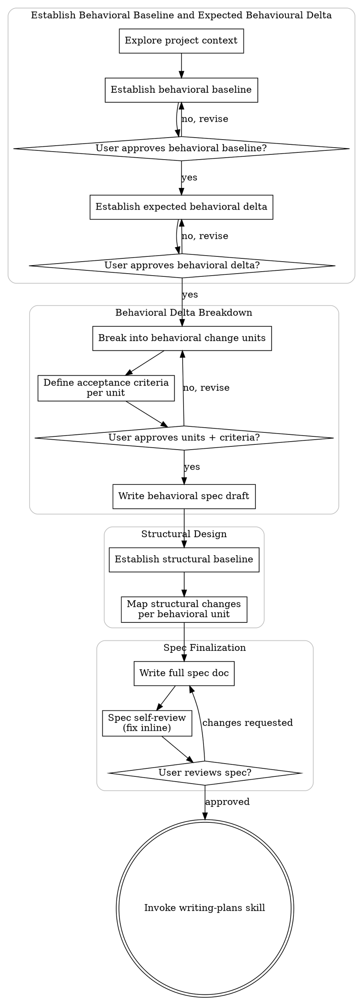

# Transforming user demands into specs

All changes in the code, even the smallest, happen downward from a spec and a plan.
All user demands, from product behaviour evolution to refactoring, MUST go through the following process.

<HARD-GATE>
Do NOT invoke any implementation skill, write any code, scaffold any project, or take any implementation action until you have presented a spec and the user has approved it. This applies to EVERY project regardless of perceived simplicity.
</HARD-GATE>

## Anti-Pattern: "This Is Too Simple To Need A Design"

Every project goes through this process. A todo list, a single-function utility, a config change — all of them. "Simple" projects are where unexamined assumptions cause the most wasted work. The spec can be short, but you MUST present it and get approval.

## Process Flow

**The terminal state is invoking writing-plans.** Do NOT invoke frontend-design, mcp-builder, or any other implementation skill. The ONLY skill you invoke after making-changes is writing-plans.

## Checklist

Use one checklist, but start from the appropriate point:

- **New evolution:** the user is asking for a behavior change that has not already gone through this spec process and has not already been implemented. Start from step 1.
- **Iteration:** a previous spec/plan/implementation already exists, and the user is asking for an additional behavior change or correction on top of it. Start from step 3, using the existing spec and implemented behavior as the inherited baseline.
- **Refactoring:** the user is asking for internal structural change with no intended external behavior change. Use the dedicated refactoring skill instead of this checklist.

Ask clarifying questions whenever they are needed to complete or validate a step,
but do not treat them as a separate checklist item.

You MUST create a task for each applicable item and complete them in order:

1. **Explore project context** — check files, docs, recent commits
2. **Establish behavioral baseline** — describe how the system behaves today
3. **Establish expected behavioral delta** — describe what behavior should change
4. **Present behavioral baseline and delta** — get user approval before decomposing behavior
5. **Break delta into behavioral change units** — identify the smallest meaningful behavior changes
6. **Create acceptance criteria** — define how each behavioral change unit will be proven
7. **Present behavioral units and criteria** — get user approval before moving into structure
8. **Write behavioral spec draft** — document behavioral units and acceptance criteria
9. **Establish structural baseline** — describe the current structure that supports the affected behavior
10. **Map structural changes** — identify required structural changes for each behavioral unit
11. **Write full spec doc** — save to `docs/meanpowers/specs/YYYY-MM-DD-<topic>-design.md` and commit
12. **Spec self-review** — quick inline check for placeholders, contradictions, ambiguity, scope (see below)
13. **User reviews written spec** — ask user to review the spec file before proceeding
14. **Transition to implementation planning** — invoke writing-plans skill to create implementation plan

## The Process

### 1. Explore Project Context

Check out the current project state first: files, docs, existing specs, tests,
and recent commits.

Pay particular attention to existing specs. They may already contain useful
information about the behavioral baseline.

### 2. Establish Behavioral Baseline

Describe how the system behaves today.

Ask clarifying questions whenever needed to establish or validate the baseline.
Ask one question per message if a topic needs more exploration.

### 3. Establish Expected Behavioral Delta

Describe what behavior should change.

Ask clarifying questions whenever needed to establish or validate the expected
delta. Ask one question per message if a topic needs more exploration.

TODO: Decide where and how to assess whether the requested behavioral delta is
too large for one spec and should be broken into multiple specs.

### 4. Present Behavioral Baseline And Delta

Present the current behavioral baseline and expected behavioral delta to the
user for approval.

If the user does not approve, revise the baseline or delta as needed before
continuing.

TODO: Revisit how to scale sections to their complexity when presenting
baseline/delta and later spec sections.

### 5. Break Delta Into Behavioral Change Units

Break the approved delta into behavioral change units: the smallest meaningful
behavior changes that can be reasoned about independently.

### 6. Create Acceptance Criteria

For each behavioral change unit, define acceptance criteria that prove whether
the promised behavior is matched.

### 7. Present Behavioral Units And Criteria

Present the behavioral units and acceptance criteria to the user for approval.

If the user does not approve, revise the behavioral change units and criteria
before continuing.

### 8. Write Behavioral Spec Draft

Write a behavior-only draft that documents the behavioral change units and their
acceptance criteria.

### 9. Establish Structural Baseline

Describe the current structure that supports the affected behavior.

### 10. Map Structural Changes

Loop over the behavioral change units and identify what structural changes need
to happen to match the promised behavioral change.

If structural analysis surfaces design decisions, architectural decisions, or
trade-offs that may affect the promised behavior, document them with the user.
It is acceptable to revise the behavioral change when structural analysis
reveals constraints or better options.

TODO: Decide how much of the existing "working in existing codebases" guidance
belongs here.

### 11. Write Full Spec Doc

Write the full spec document to `docs/meanpowers/specs/YYYY-MM-DD-<topic>-design.md`.

TODO: Decide whether to commit the spec document here.

### 12. Spec Self-Review

Look at the spec with fresh eyes and check for placeholders, contradictions,
ambiguity, and scope problems.

Fix issues inline before asking the user to review.

### 13. User Reviews Written Spec

Ask the user to review the written spec before proceeding.

If the user requests changes, revise the spec and repeat the self-review.
Only proceed once the user approves.

### 14. Transition To Implementation Planning

Invoke the writing-plans skill to create or update the implementation plan.

Do NOT invoke any other implementation skill. writing-plans is the next step.
