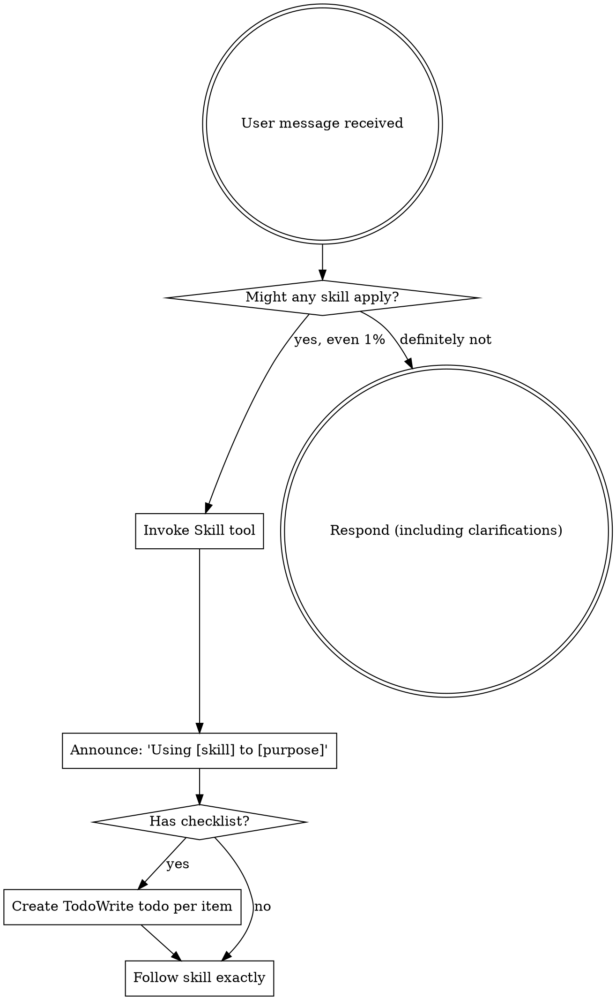

<SUBAGENT-STOP>
If you were dispatched as a subagent to execute a specific task, skip this skill.
</SUBAGENT-STOP>

<EXTREMELY-IMPORTANT>
If you think there is even a 1% chance a skill might apply to what you are doing, you ABSOLUTELY MUST invoke the skill.

IF A SKILL APPLIES TO YOUR TASK, YOU DO NOT HAVE A CHOICE. YOU MUST USE IT.

This is not negotiable. This is not optional. You cannot rationalize your way out of this.
</EXTREMELY-IMPORTANT>

## Instruction Priority

Superpowers skills override default system prompt behavior, but **user instructions always take precedence**:

1. **User's explicit instructions** (CLAUDE.md, GEMINI.md, AGENTS.md, direct requests) — highest priority
2. **Superpowers skills** — override default system behavior where they conflict
3. **Default system prompt** — lowest priority

If CLAUDE.md, GEMINI.md, or AGENTS.md says "don't use TDD" and a skill says "always use TDD," follow the user's instructions. The user is in control.

## Routing Table
TODO

## How to Access Skills

**In Claude Code:** Use the `Skill` tool. When you invoke a skill, its content is loaded and presented to you—follow it directly. Never use the Read tool on skill files.

**In Gemini CLI:** Skills activate via the `activate_skill` tool. Gemini loads skill metadata at session start and activates the full content on demand.

## Platform Adaptation

Meanpowers skills describe required capabilities, not fixed tool names. Use the
platform-native tool that provides the required capability. Do not skip a
capability because the exact tool name differs from an example.

| Capability | Claude Code | Codex | Gemini CLI |
|------------|-------------|-------|------------|
| Invoke a skill | `Skill` tool | Native skill loading; follow the skill instructions | `activate_skill` |
| Track runtime progress | `TodoWrite` or task-list tools | `update_plan` | `write_todos` |
| Dispatch an isolated subagent | `Agent` tool (`Task` in older docs/examples) | `spawn_agent`, then `wait_agent`/`close_agent` | No direct equivalent; use the documented fallback |
| Run shell commands | `Bash` | shell command tool | `run_shell_command` |
| Read files | `Read` | file/shell read tools | `read_file` |
| Write or edit files | `Write`/`Edit` | apply the platform's file-edit mechanism | `write_file`/`replace` |

### Coordination Model

Keep these concepts separate:

- Durable specs and implementation plans live in files.
- Runtime progress lives in the platform's task/progress tracker.
- Subagent dispatch delegates bounded work to an isolated context.
- The main agent owns orchestration, sequencing, review gates, and the global progress list.
- Subagents execute the specific task they were given and return a bounded result.

When a skill says to create a checklist, use the platform's runtime progress
tracker. This does not execute work and is not the durable implementation plan.

When a skill says to dispatch a reviewer, implementer, explorer, or other
specialist, use the platform's subagent/delegation mechanism. If named agents
are supported, use the named specialist. If named agents are not supported,
start a generic isolated worker with the prompt template supplied by the skill.

If a required capability is unavailable, do not silently approximate the
workflow. Use the skill's fallback if it defines one; otherwise stop and tell
the user which capability is missing and what quality gate would be weakened.

# Using Skills

## The Rule

**Invoke relevant or requested skills BEFORE any response or action.** Even a 1% chance a skill might apply means that you should invoke the skill to check. If an invoked skill turns out to be wrong for the situation, you don't need to use it.

## Red Flags

These thoughts mean STOP—you're rationalizing:

| Thought | Reality |
|---------|---------|
| "This is just a simple question" | Questions are tasks. Check for skills. |
| "I need more context first" | Skill check comes BEFORE clarifying questions. |
| "Let me explore the codebase first" | Skills tell you HOW to explore. Check first. |
| "I can check git/files quickly" | Files lack conversation context. Check for skills. |
| "Let me gather information first" | Skills tell you HOW to gather information. |
| "This doesn't need a formal skill" | If a skill exists, use it. |
| "I remember this skill" | Skills evolve. Read current version. |
| "This doesn't count as a task" | Action = task. Check for skills. |
| "The skill is overkill" | Simple things become complex. Use it. |
| "I'll just do this one thing first" | Check BEFORE doing anything. |
| "This feels productive" | Undisciplined action wastes time. Skills prevent this. |
| "I know what that means" | Knowing the concept ≠ using the skill. Invoke it. |

## Skill Priority

When multiple skills could apply, use this order:

1. **Process skills first** (brainstorming, debugging) - these determine HOW to approach the task
2. **Implementation skills second** (frontend-design, mcp-builder) - these guide execution

"Let's build X" → brainstorming first, then implementation skills.
"Fix this bug" → debugging first, then domain-specific skills.

## Skill Types

**Rigid** (TDD, debugging): Follow exactly. Don't adapt away discipline.

**Flexible** (patterns): Adapt principles to context.

The skill itself tells you which.

## User Instructions

Instructions say WHAT, not HOW. "Add X" or "Fix Y" doesn't mean skip workflows.
